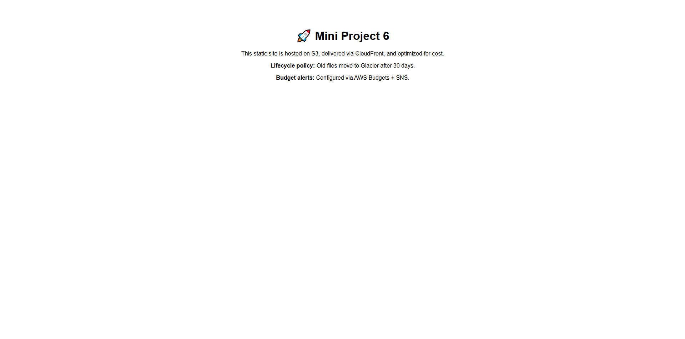

# AWS S3 + CloudFront Static Website (Terraform)

[](https://dizmxc88hpi53.cloudfront.net/)

> **Note:** This link works only when the infrastructure is deployed.  
> If the live site is offline, see the preview below:



## 📌 Overview
This project deploys a **production-ready static website** to AWS using:
- **Amazon S3** (Static Website Hosting)
- **Amazon CloudFront** (Global CDN for performance)
- **Terraform** (Infrastructure as Code)

It’s designed for **high availability**, **low latency**, and **cost efficiency**, using AWS Free Tier where possible.

---

## 🚀 Architecture
```

\[User] 🌍
↓ (HTTPS Request)
\[CloudFront Distribution] ⚡ (CDN + SSL)
↓ (Origin Access Identity)
\[S3 Bucket] 📦 (Static Website Files)

```

**Key Features:**
- Global content delivery via **CloudFront**
- Private S3 bucket with **OAI (Origin Access Identity)** for security
- Infrastructure fully automated with Terraform
- Easy teardown with `terraform destroy` to avoid costs

---

## 🛠 Tech Stack
- **AWS S3** – Static website hosting
- **AWS CloudFront** – Content Delivery Network
- **Terraform** – Infrastructure as Code
- **GitHub** – Version control

---

## 📂 Project Structure
```

.
├── main.tf               # Main Terraform config
├── variables.tf          # Input variables
├── outputs.tf            # Output values
├── backend.tf            # Remote backend (S3 + DynamoDB)
├── index.html            # Sample website
└── README.md             # Project documentation

````

---

## ⚙️ Deployment Steps

### 1️⃣ Clone the repo
```bash
git clone https://github.com/Syamel111/aws-s3-cloudfront-static-site.git
cd aws-s3-cloudfront-static-site
````

### 2️⃣ Configure AWS credentials

Make sure your AWS CLI is configured:

```bash
aws configure
```

### 3️⃣ Initialize Terraform

```bash
terraform init
```

### 4️⃣ Apply the configuration

```bash
terraform apply
```

Type `yes` when prompted.

---

## 🌐 Access the Website

After deployment, Terraform will output your **CloudFront domain**:

```
cloudfront_domain = "dxxxxx.cloudfront.net"
```

Visit that URL in your browser or click the **Live Demo badge** above.

---

## 💰 Cost Considerations

This setup uses **AWS Free Tier** for most resources:

* S3 storage (5GB free)
* CloudFront (50GB data transfer out per month free)
* DynamoDB (for remote state locking)

⚠️ **To avoid charges**:
Run:

```bash
terraform destroy
```

when you no longer need the infrastructure.

---

## 🧹 Cleanup

```bash
terraform destroy
```

This will remove **all** resources created by Terraform.

---

## 📜 License

This project is licensed under the MIT License.

---

## 👤 Author

**Syamel Amri**

* 💼 [GitHub Profile](https://github.com/Syamel111)


